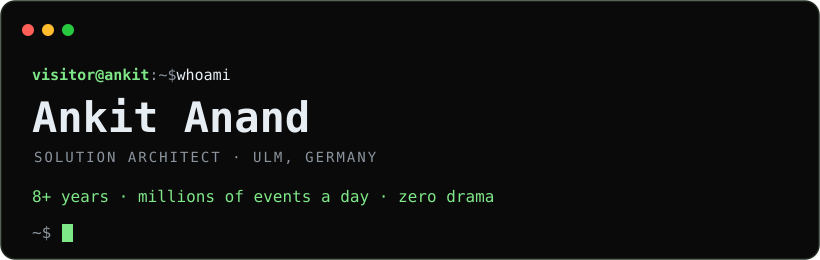
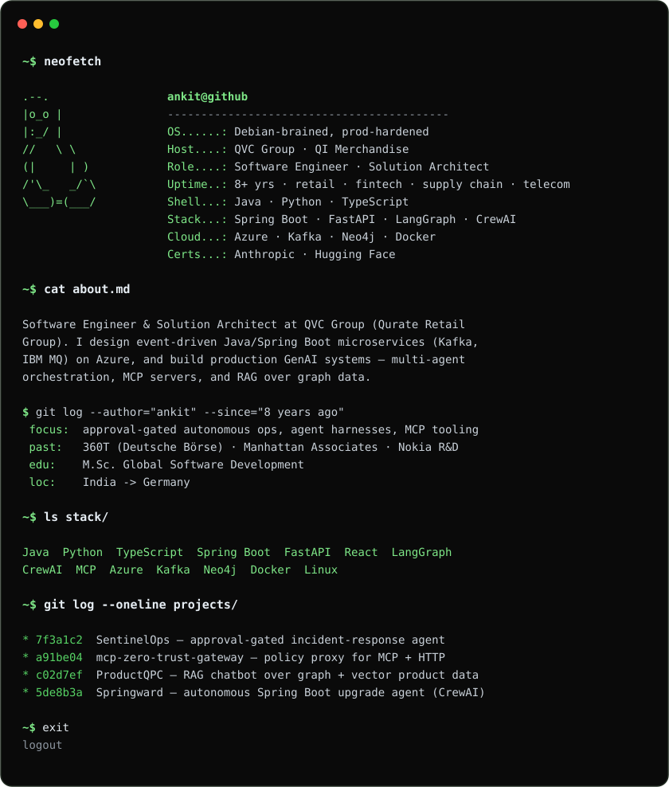

<!--
============================================================
  PROFILE README — full black + green terminal (image-based)
  Commit THREE files to github.com/snipperankit/snipperankit :
    1. this file        -> README.md            (repo root)
    2. hero.svg         -> assets/hero.svg
    3. terminal.svg     -> assets/terminal.svg
  Everything visible is a dark SVG or a dark badge, so it stays
  black+green in BOTH GitHub light and dark mode.
  Links live as badges (below the terminal), because a link
  can't be clickable inside an SVG image.
============================================================
-->

<!-- clickable project links (repos) -->

 

